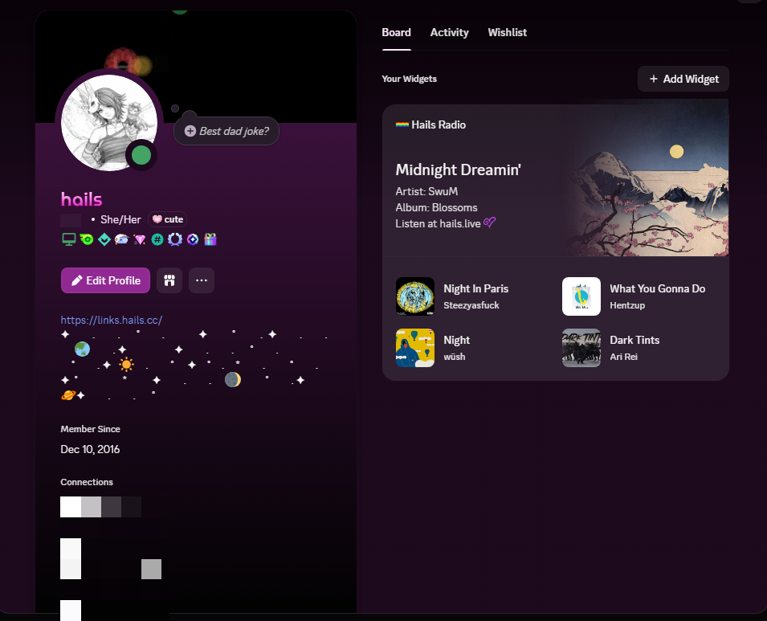
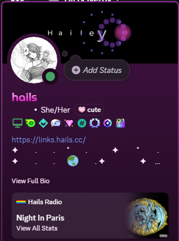

# hails.live Discord Widget

A service that bridges an [AzuraCast](https://azuracast.com) radio station with Discord's profile widget system (Widget v2 / Social Layer). It polls the AzuraCast public API every 30 seconds and pushes live now-playing data to a Discord profile widget.

## Preview

<a href="preview1.png"></a>
<a href="preview2.png"></a>

## How It Works

1. AzuraCast exposes a public JSON API at `/api/nowplaying/{station}` with the current track, artist, album art, listener count, and song history.
2. `sync.js` fetches that endpoint on an interval and formats the data into Discord's identity profile payload.
3. The payload is sent via `PATCH` to Discord's Social Layer API, updating the widget shown on your Discord profile.
4. The widget layout itself is configured once in the Discord Developer Portal and maps named data fields to visual elements.

## Prerequisites

* An AzuraCast instance with at least one public station
* A Discord application with Social SDK access (see setup below)
* Node.js 18 or later on your server
* PM2 for process management (`npm install -g pm2`)

## Discord Developer Portal Setup

These steps are completed once in the [Discord Developer Portal](https://discord.com/developers/applications).

### 1. Enable Social SDK Access

Open your application, go to **Games > Social SDK**, and submit the access form. Access is granted instantly.

### 2. Enable the Widget Editor Experiment

Open the Developer Portal in your browser, open the console (F12), and run:

```js
let _mods = webpackChunkdiscord_developers.push([[Symbol()],{},r=>r.c]);
webpackChunkdiscord_developers.pop();

let findByProps = (...props) => {
    for (let m of Object.values(_mods)) {
        try {
            if (!m.exports || m.exports === window) continue;
            if (props.every((x) => m.exports?.[x])) return m.exports;
            for (let ex in m.exports) {
                if (props.every((x) => m.exports?.[ex]?.[x]) && m.exports[ex][Symbol.toStringTag] !== 'IntlMessagesProxy') return m.exports[ex];
            }
        } catch {}
    }
}

findByProps("getAll").getAll().find(e=>e.getName() === "ApexExperimentStore").createOverride("2026-03-widget-config-editor", 1)
```

Then click the back arrow and reopen your application without refreshing. A **Widget** page will appear under Games in the sidebar.

### 3. Create the Widget Layout

In the Widget editor, create your layout and map the following **User Data** fields. The Data Field names must match exactly:

| Data Field | Type | Description |
|---|---|---|
| `track_title` | Text | Currently playing track |
| `artist` | Text | Artist name, prefixed with "Artist:" |
| `album` | Text | Album name, prefixed with "Album:" |
| `playlist` | Text | AzuraCast playlist name, prefixed with "Playlist:" |
| `live_status` | Text | "Auto DJ" or "Live: Name" when streaming live |
| `listeners` | Number | Current listener count |
| `song_elapsed` | Number | Seconds elapsed in current track (for progress bar Current Value) |
| `song_duration` | Number | Total track duration in seconds (for progress bar Max Value) |
| `elapsed_formatted` | Text | Elapsed time formatted as M:SS |
| `duration_formatted` | Text | Total duration formatted as M:SS |
| `album_art` | Image | Album art from AzuraCast |
| `history_1_title` | Text | Most recent previous track title |
| `history_1_artist` | Text | Most recent previous track artist |
| `history_1_art` | Image | Most recent previous track album art |
| `history_2_title` | Text | Second most recent track title |
| `history_2_artist` | Text | Second most recent track artist |
| `history_2_art` | Image | Second most recent track album art |
| `history_3_title` | Text | Third most recent track title |
| `history_3_artist` | Text | Third most recent track artist |
| `history_3_art` | Image | Third most recent track album art |
| `history_4_title` | Text | Fourth most recent track title |
| `history_4_artist` | Text | Fourth most recent track artist |
| `history_4_art` | Image | Fourth most recent track album art |

Save and Publish the widget when done.

### 4. OAuth2 Authorization

1. Go to **OAuth2** in the sidebar
2. Add `https://discord.com` as a Redirect URI and save
3. In the URL Generator, select the scopes `openid` and `sdk.social_layer`
4. Select your redirect URI, copy the generated URL
5. In the URL, change `response_type=code` to `response_type=token`
6. Open the modified URL in your browser and authorize it

### 5. Issue Your Identity

Go to the **Bot** page, reset your token, and copy it. Then run the following in PowerShell, filling in your values:

```powershell
$APP_ID    = "YOUR_APPLICATION_ID"
$USER_ID   = "YOUR_DISCORD_USER_ID"
$BOT_TOKEN = "YOUR_BOT_TOKEN"

$body = '{"username":"hails.live","data":{"dynamic":[{"type":1,"name":"track_title","value":"Sample Track"},{"type":1,"name":"artist","value":"Artist: Sample Artist"},{"type":2,"name":"listeners","value":0}]}}'

Invoke-RestMethod `
  -Uri "https://discord.com/api/v9/applications/$APP_ID/users/$USER_ID/identities/0/profile" `
  -Method PATCH `
  -Headers @{
    "Content-Type"  = "application/json"
    "Authorization" = "Bot $BOT_TOKEN"
    "User-Agent"    = "DiscordBot (https://github.com/discord/discord-api-docs, 1.0.0)"
  } `
  -Body $body
```

No output means success.

### 6. Add the Widget to Your Profile

In your Discord client, enable the renderer experiment by running this in the console (wrap in braces if you see a redeclaration error):

```js
{
    let _mods = webpackChunkdiscord_app.push([[Symbol()],{},r=>r.c]);
    webpackChunkdiscord_app.pop();
    let findByProps = (...props) => {
        for (let m of Object.values(_mods)) {
            try {
                if (!m.exports || m.exports === window) continue;
                if (props.every((x) => m.exports?.[x])) return m.exports;
                for (let ex in m.exports) {
                    if (props.every((x) => m.exports?.[ex]?.[x]) && m.exports[ex][Symbol.toStringTag] !== 'IntlMessagesProxy') return m.exports[ex];
                }
            } catch {}
        }
    }
    findByProps("getAll").getAll().find(e=>e.getName() === "ApexExperimentStore").createOverride("2026-03-application-widget-v2-renderer", 1)
}
```

Then add the widget to your profile. If you have Vencord installed:

```js
async function addWidget(appId) {
    id = Vencord.Webpack.findByProps("getCurrentUser").getCurrentUser().id;
    current_widgets = (await Vencord.Webpack.Common.RestAPI.get("/users/" + id + "/profile")).body.widgets
    if (current_widgets.map(x=>x.data?.application_id).includes(appId)) {
        return console.log("Already in your widgets");
    }
    current_widgets.unshift({"data":{"type":"application","application_id":appId}})
    await Vencord.Webpack.Common.RestAPI.put({url:"/users/@me/widgets",body:{widgets:current_widgets}})
}
addWidget("YOUR_APPLICATION_ID")
```

For other methods, check the Discord Previews server thread for ready-to-run snippets.

## Server Setup

Upload all project files to your server, then:

```bash
cd /path/to/hails.widgetcast
npm install
cp .env.example .env
nano .env
```

Fill in your `.env`:

```
BOT_TOKEN=your_bot_token
APPLICATION_ID=your_application_id
USER_ID=your_discord_user_id
```

Test it runs correctly:

```bash
node sync.js
```

You should see a track change logged within a few seconds. Once confirmed, hand it to PM2:

```bash
pm2 start ecosystem.config.cjs
pm2 save
pm2 startup
```

Run the command that `pm2 startup` outputs to ensure the process survives reboots.

## Useful Commands

```bash
pm2 logs hails.widgetcast      # view live output
pm2 restart hails.widgetcast   # restart after uploading code changes
pm2 status                         # check process health
```

## Configuration

To point this at a different AzuraCast station, edit the `AZURACAST_URL` constant at the top of `sync.js`:

```js
const AZURACAST_URL = 'http://your-azuracast-domain.com/api/nowplaying/your_station_shortcode';
```

The poll interval is also configurable via `POLL_INTERVAL_MS` (default is 30000ms / 30 seconds).
